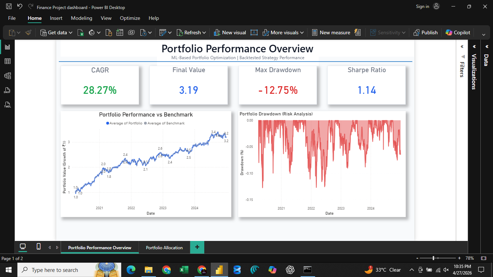
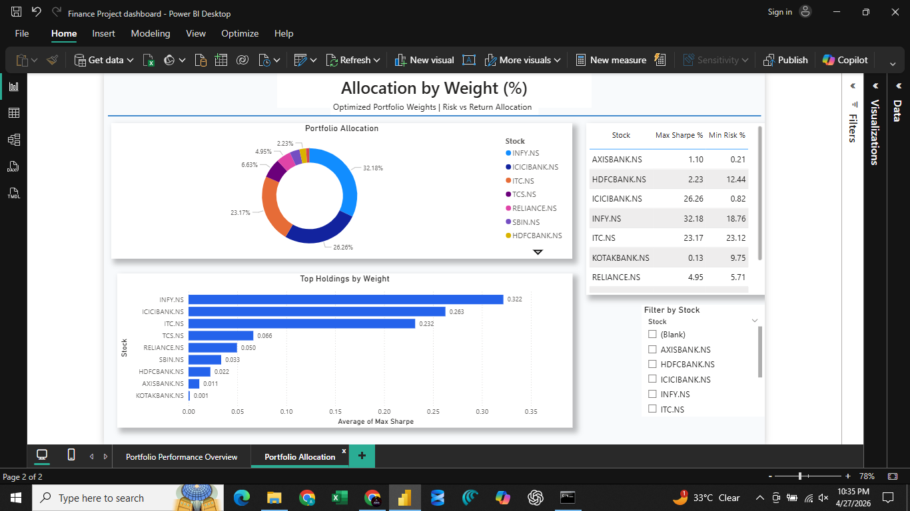

# 📊 Finance Portfolio Performance & Optimization Analysis

---

## 📌 Overview

This project focuses on analyzing portfolio performance, risk metrics, and optimal asset allocation using financial data.

The goal is to evaluate investment strategies using key performance indicators like CAGR, Sharpe Ratio, and Drawdown while optimizing portfolio weights for better risk-adjusted returns.

---

## 🧠 Problem Statement

In financial markets, investors often face challenges such as:

- Measuring actual portfolio performance  
- Understanding downside risk (drawdowns)  
- Allocating capital efficiently across stocks  
- Balancing risk vs return  

This project addresses these challenges through data-driven financial analysis and visualization.

---

## 🎯 Objectives

- Analyze portfolio growth over time  
- Measure risk using drawdown analysis  
- Evaluate performance using Sharpe Ratio  
- Compare portfolio vs benchmark  
- Optimize portfolio allocation based on risk-return tradeoff  

---

## 🛠️ Tools & Technologies

- SQL Server (SSMS) – Data extraction  
- Python (Pandas, NumPy) – Data processing  
- Power BI – Dashboard visualization  

---

## 📂 Project Structure

```
finance-portfolio-analysis/
│── finance_project.ipynb
│── finance_queries.sql
│── dashboard1.png
│── dashboard2.png
│── README.md
```

---

# 📊 Dashboard Preview

## 📌 Portfolio Performance Overview



### 🔍 Key Metrics

- **CAGR:** 28.27%  
- **Final Portfolio Value:** 3.19x  
- **Max Drawdown:** -12.75%  
- **Sharpe Ratio:** 1.14  

### 💡 Insights

- Portfolio shows strong long-term growth  
- Drawdowns are controlled, indicating manageable risk  
- Portfolio consistently outperforms benchmark  
- Sharpe ratio > 1 indicates good risk-adjusted returns  

---

## 📌 Portfolio Allocation & Optimization



### 🔍 Insights

- Highest allocation in **INFY, ICICI Bank, and ITC**  
- Portfolio is diversified across multiple stocks  
- Allocation is optimized based on Sharpe ratio  
- Top holdings contribute majority of portfolio weight  

---

## 🔍 Key Analysis

### 📊 1. Performance Analysis

- Portfolio growth trend over time  
- Benchmark comparison  
- Return consistency  

---

### 📊 2. Risk Analysis

- Drawdown behavior  
- Downside risk identification  
- Volatility tracking  

---

### 📊 3. Portfolio Optimization

- Weight allocation using Sharpe ratio  
- Risk vs return balancing  
- Identification of top-performing assets  

---

## 💡 Key Insights

- Strong CAGR indicates high portfolio returns  
- Controlled drawdown reflects good risk management  
- Diversification reduces overall risk  
- Few stocks dominate portfolio performance (Pareto principle)  

---

## 📈 Resume Highlights

- Built end-to-end finance portfolio analysis project  
- Evaluated performance using CAGR, Sharpe Ratio, and Drawdown  
- Designed interactive Power BI dashboard  
- Applied data-driven portfolio optimization techniques  
- Analyzed risk vs return for investment decision-making  

---

## 🚀 Future Improvements

- Integrate real-time stock market data  
- Build predictive models for portfolio returns  
- Automate portfolio rebalancing strategies  

---

## 🤝 Connect

If you found this project useful or want to collaborate, feel free to connect!
